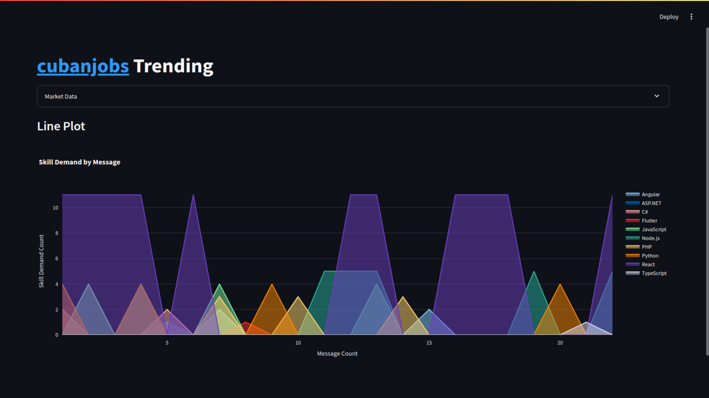
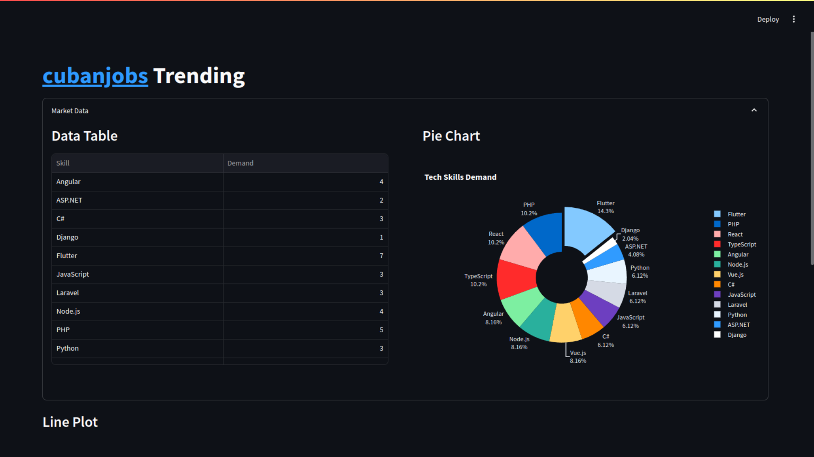

# cubanjobs_trending

Streamlit app showcasing demand over time of some skills at <a href="https://t.me/cubanjobs">cubanjobs</a>.

## How to use?
Go <a href="https://my.telegram.org"/>, get an `API_ID` and `API_HASH` and write them to `secrets.json`.

Install requirements with: 
- `pip install -r requirements.txt`
Then run the app with: 
- `streamlit run app.py`

## Screenshots

