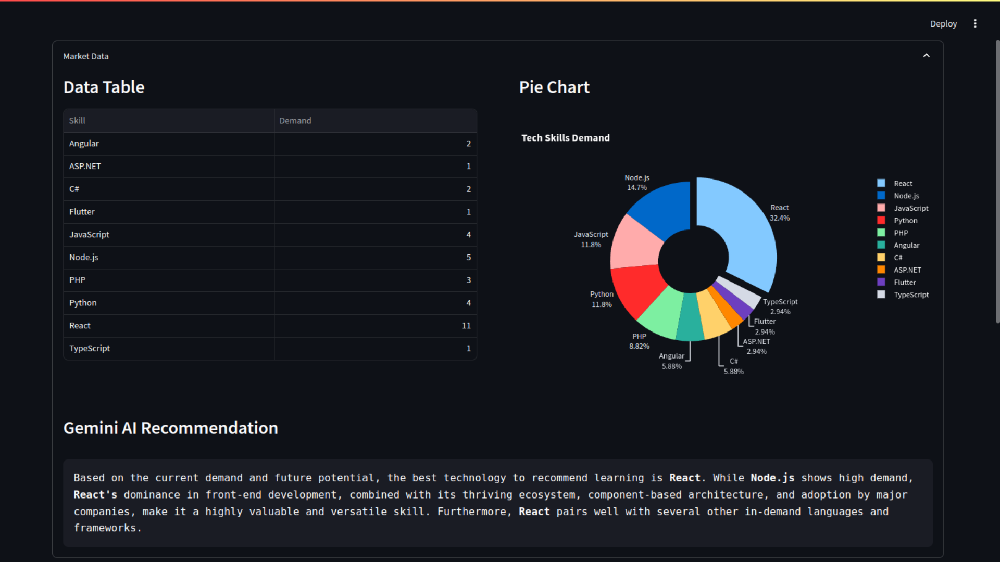

# cubanjobs_trending

Streamlit app showcasing demand over time of some skills at <a href="https://t.me/cubanjobs">cubanjobs</a> + AI-powered recommendation!

## How to use?
Go to <a href="https://my.telegram.org">my.telegram.org</a> to get an `API_ID` and `API_HASH`, also visit <a href="https://aistudio.google.com/">aistudio.google.com</a> to get a `GEMINI_API_KEY`.
Add them to `secrets.json`.

Install requirements with: 
- `pip install -r requirements.txt`

Then run the app with: 
- `streamlit run app.py`

## Screenshots

